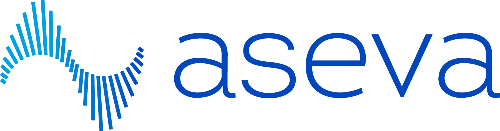

# Aseva Sales Deck — Design System

The visual contract. Reproduce these values exactly when generating new decks.

---

## 1. Canvas

- **Slide size:** 1920 × 1080 px (16:9)
- **Letterboxing:** handled by `deck-stage.js`. Just set `<deck-stage width="1920" height="1080">` and put each slide as a direct child `<section>`.
- **Frame padding inside each slide:** `padding: 96px 120px 140px 120px;` — top / sides / bottom. The 140px bottom clears the page-meta footer.

---

## 2. Color tokens

Defined as CSS custom properties on `:root`:

```css
:root {
  --primary:           #051a35;  /* deep navy — backgrounds, headlines */
  --secondary:         #00a1e2;  /* brand cyan — eyebrows, accents, CTAs */
  --supplemental:      #0071ce;  /* deeper blue — pill backgrounds, badges */
  --blue-light:        #86C1E9;  /* tints, secondary accents */
  --blue-extra-light:  #EEFAFF;  /* surface tint */
  --grey:              #475467;  /* body copy on light surfaces */
  --grey-medium:       #7b8792;  /* secondary text */
  --grey-light:        #F0F3F4;  /* card surfaces, dividers */
  --white:             #ffffff;
  --coral:             #EF6B51;  /* sparingly — alert / "different" accents */
}
```

### Where each color is used

- **`--primary` (navy)** — cover slide background, section divider backgrounds, the differentiator slide background, all dark-mode partner logo panels (e.g. Cato), close/CTA slide background.
- **`--secondary` (cyan)** — every eyebrow label, the highlighted word in titles via `<em>`, the close-CTA pill button, accent rules, accent dots, the waveform SVG fill.
- **`--supplemental` (deeper blue)** — partner-badge pill backgrounds on light surfaces.
- **`--grey` (#475467)** — all body copy on white surfaces.
- **`--white`** — all body copy on dark surfaces, with `rgba(255,255,255,0.82)` for de-emphasized white text and `rgba(255,255,255,0.55)` for tertiary text on dark.
- **`--blue-extra-light`, `--grey-light`** — subtle surface tints (capability grid card backgrounds use plain white with a `1px solid #d1d6dc` border instead).

### Hard rules

- Never invent new colors. Use only the tokens above.
- Logo panel background must contrast with the logo's own fill. The Cato logo is white-on-green, so its panel must be navy (`--primary`), NOT green. The eSentire logo is dark-on-light so its panel uses `#f4f7fb`.

---

## 3. Typography

- **Headings:** `Source Sans 3` (Google Fonts). Loaded with weights 300, 400, 600, 700. Falls back to `Source Sans Pro`, then `sans-serif`.
- **Body:** `Open Sans` (Google Fonts). Weights 400, 500, 600, 700.

```html
<link href="https://fonts.googleapis.com/css2?family=Source+Sans+3:wght@300;400;600;700&family=Open+Sans:wght@400;500;600;700&display=swap" rel="stylesheet" />
```

### Type scale (1920×1080 canvas)

| Element | Family | Weight | Size | Line-height | Notes |
|---|---|---|---|---|---|
| Cover h1 | Source Sans 3 | 400 | 88–120px | 1.02–1.05 | Letter-spacing −0.01em |
| Section title (h2.title) | Source Sans 3 | 600 | 72px | 1.1 | Letter-spacing −0.005em, margin-bottom 48px |
| Section divider title | Source Sans 3 | 300 | 40px subtitle / 72px+ headline | 1.35 | White-on-navy |
| Partner h2 | Source Sans 3 | 600 | 40px | 1.08 | Margin-bottom 14px |
| Subhead (h3.sub) | Source Sans 3 | 600 | 32px | 1.25 | Cyan |
| Capability card h4 | Source Sans 3 | 600 | 28px | 1.2 | Navy |
| Diff card h4 | Source Sans 3 | 600 | 26px | — | Cyan |
| Partner point h5 | Source Sans 3 | 600 | 24px | — | Navy |
| Lede paragraph | Source Sans 3 | 300 | 36–42px | 1.3 | White on dark, navy on light |
| Card body p | Open Sans | 400 | 24px | 1.35–1.5 | Grey |
| Eyebrow | Open Sans | 600 | 24px | — | Uppercase, letter-spacing 0.14em–0.32em, cyan |
| Page-meta | Open Sans | 400 | 24px | — | Grey, letter-spacing 0.04em |
| Close CTA pill text | Open Sans | 600 | 24px | — | White on cyan |

### Hard rules

- **Never go below 24px for any text on a 1920×1080 slide.** This is a hard floor.
- The `<em>` tag inside titles is repurposed as a brand-cyan accent — `font-style: normal; color: var(--secondary); font-weight: 600;`.

---

## 4. Slide archetypes

The deck uses six recurring layout archetypes. Reuse these — do not invent new ones.

### A. Cover (`.cover`)

- Background: `--primary` (navy)
- Right-aligned waveform SVG bg at 0.85 opacity
- Left-aligned content stack: aseva-horizontal logo (inverted to white via `filter: brightness(0) invert(1)`) → eyebrow → kicker headline (font-size 96–120px, light, with `<em>` accent in cyan)
- Footer line at bottom-left with contact details, low-opacity white
- No page-meta footer

### B. Section divider (`.section-divider`)

- Background: `--primary` navy with waveform SVG accent
- Single big heading + supporting paragraph in white/light-white
- A small "Pillar one/two/three" kicker in cyan above the heading
- Page-meta footer in low-opacity white

### C. Two-column "Who we are" / "Why us" (`.who`, `.whyus`)

- Light background
- Eyebrow → h2.title spanning two lines (with `<br/>` break)
- Two-column body: left = lede + body paragraphs, right = stats card or pillar list
- Page-meta footer

### D. Capability grid (`.provide`)

- Light background
- Eyebrow → hero-row (1.3fr h2.title + 1fr lede paragraph) → 3-column card grid
- Each card: white surface, `1px solid #d1d6dc` border, 12px radius, 20–24px padding
- Card structure: small uppercase cyan label → h4 (28px navy) → body p (24px grey)
- Max 6 cards (2 rows of 3)

### E. Partner split (`.partner`)

- Light background
- Eyebrow at top spanning full width
- Two-column body: left = colored logo panel, right = headline + intro + 3 numbered points
- Logo panel: full height, contrasting bg (navy for white-fill logos, light grey for dark-fill logos), "Premier partnership" eyebrow at top, large logo centered, partner-meta with role/coverage at bottom separated by a 1px rule
- Right column: small pill badge ("Flagship X partner") → h2 (40px) → intro p (24px grey) → list of 3 `.point`s, each with a 40px cyan bar + h5 + p
- Hard limit: **3 points maximum** per partner slide. Adding a 4th overflows the frame.

### F. Close / CTA (`.cover` reused)

- Same navy background as cover
- Eyebrow with letterspaced "Connect · Discover · Solve · Guide"
- Massive h1 (120px) with `<em>` cyan accent on the key noun
- Supporting paragraph in light Source Sans (44px, 300 weight)
- A pill-shaped CTA button in cyan with arrow

---

## 5. Recurring motifs

### Waveform SVG

A vertical bar-chart shape that evokes a signal waveform. Used at three scales:

1. **Background motif** on cover and close slide — full-canvas, 0.85 opacity, cyan
2. **Decorative accent** on dark slides like the differentiator — same SVG, smaller, lower opacity
3. **Brandmark glyph** in the corner-logo and standalone uses

The SVG path is a series of `<rect>` elements with varying heights forming a sine-like curve. Reuse the existing SVG block from the template; do not redraw.

### Page-meta footer

Every content slide (not cover, not close) has this at the bottom:

```html
<div class="page-meta">
  <span>Aseva · <SectionName></span>
  <span class="rule"></span>
  <span><PageNumber></span>
</div>
```

- Position: `absolute; bottom: 44px; left: 120px; right: 120px;`
- Style: 24px Open Sans, letter-spacing 0.04em, grey on light slides, low-opacity white on dark
- The `.rule` is a 1px hairline filling the space between

### Corner logo

```html

```

- Position: `absolute; top: 48px; left: 120px;`
- Height: 36px
- Appears on every content slide except cover, close, and section dividers

### Eyebrow label

```html
<p class="eyebrow">Section Name · Subsection</p>
```

- Open Sans 600, 24px, uppercase, letter-spacing 0.14em
- Color: `--secondary` (cyan) on light, sometimes `rgba(255,255,255,0.55)` on dark
- Margin-bottom: 28px

---

## 6. Required attributes

Every `<section>` slide must have:

- `data-label="NN Slide Name"` — for screen labels (matches the human-visible slide counter, 01-indexed)
- A class for the layout archetype: `cover`, `section-divider`, `who`, `whyus`, `provide`, `partner`, `cyber`, `diff`

The `deck-stage` component auto-applies `data-screen-label` and `data-om-validate` on top of these.

---

## 7. Things to never do

- Never use Inter, Roboto, Arial, system-ui, or any font outside Source Sans 3 + Open Sans
- Never use rounded-corner cards with a left-border accent stripe (AI design trope)
- Never use emoji
- Never invent new colors — only use the tokens
- Never go below 24px text
- Never put text closer than 140px from the bottom edge (overflows page-meta)
- Never use SVG to fake a logo — always use the real PNG from `assets/`
